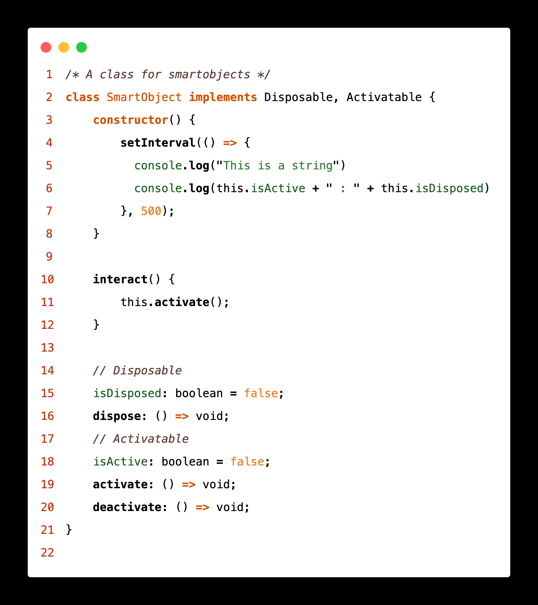

# 🐱 Calico Theme for VS Code

Inspired by my beloved calico cat Delilah, this theme brings the beautiful contrast and warmth of calico cat colors to your coding environment. Just as Delilah brightens my day with her unique patches of orange, black, and white fur (with hints of green eyes!), this theme aims to make your coding experience both visually pleasing and highly readable.



## Theme Variants

The Calico theme comes in six beautiful variants to suit your preferences:

- **Calico Light Flat** - A clean, flat design with light background
- **Calico Dark Flat** - A modern, flat design with dark background
- **Calico Light** - Classic light theme with subtle shadows and depth
- **Calico Dark** - Rich dark theme with dimensional elements
- **Calico Light High Contrast** - Enhanced contrast for accessibility
- **Calico Dark High Contrast** - Maximum contrast for low-light conditions

## Color Philosophy

Just like Delilah's distinctive coat patterns, this theme features:
- Pure blacks for core syntax (like her black patches)
- Warm oranges for constants and types (like her orange spots)
- Clean whites for the background (like her white fur)
- Subtle browns and beiges for accents (like her tortoiseshell patterns)

## Meet the Inspiration


## Features

### Design Principles
- **Flat Variants**: Modern, clean design without shadows or depth effects
- **Classic Variants**: Subtle shadows and depth for a traditional IDE feel
- **High Contrast**: Enhanced readability and WCAG 2.1 compliance

### Syntax Highlighting
- Semantic highlighting for TypeScript/JavaScript
- Rich language support including Python, Rust, HTML, CSS, and more
- Distinct colors for:
  - Classes and types
  - Functions and methods
  - Variables and constants
  - Strings and numbers
  - Comments and documentation

### UI Elements
- Carefully designed activity bar, sidebar, and status bar
- Consistent theme across all VS Code panels and widgets
- Terminal colors optimized for readability
- Git decoration colors that complement the theme

## Installation

1. Open VS Code
2. Press `Ctrl/Cmd + P`
3. Type `ext install calico`
4. Press Enter

Or install from the [VS Code Marketplace](https://marketplace.visualstudio.com/items?itemName=snenenenenenene.calico)

## Recommended Settings

For the optimal experience, try these settings:

```json
{
  "editor.renderWhitespace": "all",
  "editor.fontFamily": "Fira Mono",
  "editor.fontSize": 14,
  "editor.semanticHighlighting.enabled": true
}
```

## Language Support

The theme has been tested and optimized for:
- TypeScript/JavaScript
- React/JSX
- Python
- Rust
- HTML/CSS
- JSON
- Markdown
- And more!

## Contributing

Contributions are welcome! Please feel free to:
1. Fork the repository
2. Create a feature branch
3. Submit a Pull Request

For major changes, please open an issue first to discuss what you would like to change.

### Development

```bash
# Clone the repository
git clone https://github.com/snenenenenenene/vscode-calico

# Install dependencies
npm install

# Make your changes
# Test the theme in VS Code
# Submit a PR
```

## Feedback & Issues

If you have suggestions or find any issues:
- Open an [issue](https://github.com/snenenenenenene/vscode-calico/issues)
- Submit a [pull request](https://github.com/snenenenenenene/vscode-calico/pulls)
- Share pictures of your own calico cats! 🐱

## License

This project is licensed under the MIT License - see the [LICENSE](LICENSE) file for details.

---
*Special thanks to Delilah for being the perfect color palette inspiration and coding companion* 🐱

## Version History

See [CHANGELOG.md](CHANGELOG.md) for a list of changes and improvements.